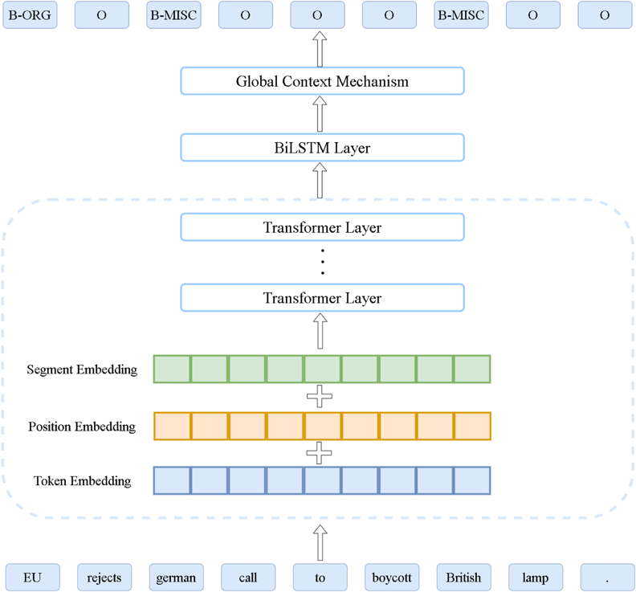

# Supplementary Features of BiLSTM for Enhanced Sequence Labeling
[Supplementary Features of BiLSTM for Enhanced Sequence Labeling](https://arxiv.org/abs/2305.19928)

# Requirements
* python==3.8.13
* torch==1.13.0
* transformers==4.27.1
* tqdm==4.64.0
* numpy==1.22.4
# Dataset
* Aspect-Based sentiment analysis (ABSA): all datasets for ABSA can be found in [(Li, 2019)](https://github.com/lixin4ever/BERT-E2E-ABSA/tree/master/data)
* Named Entity Recognition: [Conll2003](https://www.clips.uantwerpen.be/conll2003/ner/), [wnut2017](https://noisy-text.github.io/2017/emerging-rare-entities.html), [weibo](https://github.com/OYE93/Chinese-NLP-Corpus/tree/master/NER/Weibo)
* Part of Speech Tagging: [Universal Dependencies](https://universaldependencies.org/#-universal-dependencies)
# Hyperparameters
## Learning rate
 | Layers | Rest14 | Rest15 | Rest16 | Laoptop14 | Conll2003 | Wnut2017 | Weibo | Conll2003 | UD |       
 |---|---|---|---|---|---|---|---|---|---|
 | BERT | 1E-5 | 1E-5 | 1E-5 | 1E-5 | 1E-5 | 1E-5 | 1E-5 | 1E-5 | 1E-5 |
 | BiLSTM | 5E-4 | 1E-3 | 5E-4 | 5E-4 | 1E-3 | 1E-3 | 1E-3 | 1E-3 | 1E-3 |
 | context | 1E-3 | 1E-3 | 1E-5 | 1E-5 | 1E-3 | 1E-3 | 1E-3 | 1E-4 | 1E-3 |
 | classification | 1E-4 | 1E-4 | 1E-4 | 1E-4 | 1E-4 | 1E-4 | 1E-4 | 1E-4 | 1E-4 |
 | no_improve | 10 | 10 | 5 | 10 | 5 | 5 | 5 | 5 | 5 |
## Other Details
 bert-base-chinese and bert-base-cased is used for Chinese datasets and English datasets respectively.
 batch size:
* ABSA: Rest14 32, Rest15 16, Rest16 32, Laptop14 16.
* NER: 16 is applied for all datasets.
* POS Tagging: 16 is applied for all datasets.
# Quick Start
    python main.py --task_type absa --dataset_name rest14 --use_tagger True --use_context True 
# Usages
* model_name: pretrained model name.   default: bert-base-cased
* dataset_dir: root directory of Dataset. default: Dataset
* cache_dir: the directory to save pretrained model.
* use_tagger: using BiLSTM or not. default: True
* use_context: using context mechanism or not. default: False.
* learning_rate: learning rate of BERT layer. default: 1e-5
* learning_rate_tagger: learning rate of BiLSTM layer. default: 1e-3
* learning_rate_context: learning rate of context layer. default: 1e-3
* learning_rate_classifier: learning rate of classifier layer. default: 1e-4
* context_mechanism: which context mechanism will be used.  default: global.
* mode: using pretrained language or not. default: pretrained.
* no_improve: early stop steps. default 5. 
* tagger_size: dimension of BiLSTM output. default 600.   \
\
In case of that you have specific dataset format, making a new reader function which is a parameter to construct the Dataset classes. \
Rename the files under each dataset to train.txt, valid.txt and test.txt respectively. the format samples are given under each dataset directory.\
**use dataset_dir + task_type + dataset_name to fetch data** 
# Results
| Layers | Rest14 | Rest15 | Rest16 | Laoptop14 | Conll2003 | Wnut2017 | Weibo | Conll2003 | UD |
|---|---|---|---|---|---|---|---|---|---|
| BERT | 69.75 | 57.07 | 65.95 | 58.49 | 91.51 | 43.59 | 68.09 | 95.56 | 96.85 |
| BERT-BiLSTM | 73.47 | 61.14 | 71.05 | 61.12 | 91.85 | 46.95 | 68.86 | **95.66** | 95.90 |
| BERT-BiLSTM-context | **73.84** | **63.24** | **71.51** | **62.92** | **91.91** | **48.02** | **69.84** | 95.62 | **97.01** |