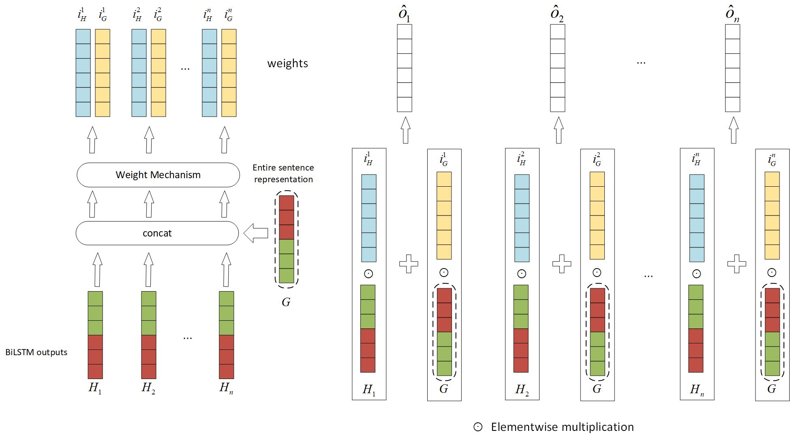

# Supplementary Features of BiLSTM for Enhanced Sequence Labeling
[Supplementary Features of BiLSTM for Enhanced Sequence Labeling](https://arxiv.org/abs/2305.19928)

The details of the global context mechanism is shown in Fig 1. 


# Requirements
* python==3.8.13
* torch==1.13.0
* transformers==4.27.1
* tqdm==4.64.0
* numpy==1.22.4
# Dataset
In our reserach, we evaluated the effectiveness of the global context mechanism across two key NER tasks:
* **Aspect-Based sentiment analysis (ABSA):** The dataset for ABSA are publicly available thansk to  [(Li, 2019)](https://github.com/lixin4ever/BERT-E2E-ABSA/tree/master/data)
* **Named Entity Recognition:** We utilized datasets from [Conll2003](https://www.clips.uantwerpen.be/conll2003/ner/), [wnut2017](https://noisy-text.github.io/2017/emerging-rare-entities.html), and [weibo](https://github.com/OYE93/Chinese-NLP-Corpus/tree/master/NER/Weibo)

# Experiments

Our experiments verify the global context mechanism on various pre-trained transformers. For English dataset, we used models including DeBERTa, RoBERTa, BERT, while for Chinese dataset, we applied MacBERT-Chinese and BERT-Chinese  respectively. In there,  we  detailed the F1 improvement and training hyper-parameters for BERT. Additionally, we utilized BertTwitter and BERT-Chinese for the Wnut2017 and Weibo datasets, respectively. 
<div style="text-align: center;">

|     **Module**      | **Rest14** | **Rest15** | **Rest16** | **Laoptop14** | **Conll2003** | **Wnut2017** | **Weibo** |
| :-----------------: | :--------: | :--------: | :--------: | :-----------: | :-----------: | :----------: | :-------: |
|        BERT         |   71.86    |   60.06    |    70.3    |     61.71     |   **92.00**   |    54.63     |   67.76   |
|     BERT-BiLSTM     |   74.08    |   62.85    |   70.27    |     60.86     |     91.68     |    55.46     |   70.25   |
| BERT-BiLSTM-Context | **74.79**  | **63.65**  | **71.86**  |   **63.33**   |     91.66     |  **56.14**   | **70.98** |
</div>
<div style="text-align: center;">
**Table 1. F1 score Improvement of the Context Mechanism on BERT**
</div>
### Hyper-parameters    

|        **Module**        | **Rest14** | **Rest15** | **Rest16** | **Laoptop14** | **Conll2003** | **Wnut2017** | **Weibo** |
|:------------------------:|:----------:|:----------:|:----------:|:-------------:|:-------------:|:------------:|:---------:|
|           BERT           |    5E-5    |    5E-5    |    5E-5    |      5E-5     |      1E-5     |     1E-5     |    1E-5   |
|          BiLSTM          |    1E-2    |    1E-3    |    8E-4    |      1E-3     |      5E-3     |     1E-3     |    1E-4   |
| global context mechanism |    1E-2    |    1E-4    |    5E-4    |      5E-5     |      1E-3     |     8E-4     |    1E-4   |
|       full-connect       |    1E-4    |    1E-4    |    1E-4    |      1E-4     |      1E-4     |     1E-4     |    1E-4   |
<div style="text-align: center;">
**Table 2. Learning rates for BERT-based Models**
</div>
The batch size for BERT-based models are as follows:

**Batch size 16:**  Laptop14, Rest15, Conll2003, Wnut2017;

**Batch size 32:**  Rest14, Rest16,  Weibo

### Other details:

**GPU:** To remedy influence the influence of hardware, we conducted our experiments on three different GPU card : Nvidia V100 16G, Nvidia A10 and Nvidia A4000. We found that the optimal learning rates for global context mechanism varied across different GPUs. Specifically, for Conll2003, Wnut2017 and Weibo, smaller learning rate were more appropriate, such as 1e-4, 5e-4 and 5e-5. However, for Rest14, 15, 16 and Laptop 14, larger learning rate were more effective.  

**Early Stopping:** we employed early stopping by the F1 score on validation dataset. The details of the early stop settings are as follows:

| **Dataset** | **Total Train Epoch** | **No Improve Epoch** |
|:-----------:|:---------------------:|:--------------------:|
|    Rest14   |           50          |          10          |
|    Rest15   |           50          |          10          |
|    Rest16   |           50          |          10          |
|   Laptop14  |           50          |          10          |
|  Conll2003  |           20          |          10          |
|   Wnut2017  |           20          |          10          |
|    Weibo    |           20          |          10          |

**Table 3. Early stopping Settings for Each Dataset.**

# Quick Start

Pret-trained mode with Bert

    python main.py --mode pretrained --model_name bert-base-cased --batch_size 32 --task_type absa --dataset_name rest14 --use_tagger True --use_context True 
Light mode with BiLSTM

```
python main.py --mode light --model_name lstm --batch_size 32 --task_type absa --dataset_name rest14  --use_context True
```

### Details of parameters

* model_name: pretrained model name.   default: bert-base-cased
* use_tagger: using BiLSTM or not. default: True
* use_context: using context mechanism or not. default: False.
* learning_rate: learning rate for pre-trained transformers. default: 1e-5
* learning_rate_tagger: learning rate for BiLSTM . default: 1e-3
* learning_rate_context: learning rate for global context mechanism. default: 1e-3
* learning_rate_classifier: learning rate for full-connect layer default: 1e-4
* context_mechanism: which context mechanism will be used [self-attention or global].  default: global.
* mode: using pretrained transformers or others light architectures like LSTM and CNN etc. default: pretrained.
* no_improve: early stop steps. default 10. 
* tagger_size: dimension of BiLSTM hidden size. default 600.

### Production usages   

You can use this training framework in production by customizing a reader to align with your custom data, while maintaining the standard of the Dataset as before. This reader function will serve as a parameter to construct the Dataset classes. 

**Note: use 'dataset_dir + task_type + dataset_name' to fetch data**

# Results

The best F1 scores we achieved using the global context mechanism on each dataset, are as follows:

|            | Rest14  | Rest15 | Rest16 | Laoptop14 | Conll2003 | Wnut2017 | Weibo        |
|------------|---------|--------|--------|-----------|-----------|----------|--------------|
| F1         | 78.14   | 67.91  | 71.86  | 68.88     | 92.67     | 59.20    | 70.98        |
| Base Model | Roberta | XLNET  | Bert   | Roberta   | Roberta   | Roberta  | Bert-Chinese |

​						**Table 4. The Best F1 Score Achieved by Global Context Mechanism**